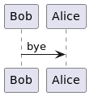

# Maco Wins

## Enunciado

Se requiere:
- Identificar los requerimientos
- Presentar una solución usando el paradigma de objetos (pseudocódigo, diagrama de clases).
- Explicar todo lo que considere necesario en prosa.
- Si se descarta alguna alternativa durante el desarrollo de la solución, o si se tiene otra solución, explicarla brevemente.

La conocida empresa de ropa formal para caballeros, Macowins, es capaz de darle soporte a la
venta de prendas. Un fragmento de la grabación del analista con el cliente:

    “Queremos saber el precio de venta de una prenda y sus tipos, los tipos de prenda son: sacos, pantalones, camisas.”

El cálculo del precio de una prenda es, el precio propio de la prenda modificado según el
estado de la prenda, que pueden ser:
- Nueva: en este caso no modifican el precio base.
- Promoción: Le resta un valor fijo decidido por el usuario.
- Liquidación: Es un 50% del valor del producto.

Ah, un requerimiento más: Macowins registra las ventas de estas prendas y necesita saber las
ganancias de un determinado día.

    “Cada venta tiene asociada las prendas que se vendieron, su cantidad y la fecha de venta.
    Las ventas pueden ser en efectivo o con tarjeta. En el caso que sea con tarjeta, tienen el
    mismo comportamiento que en efectivo (el cual no modifica el precio), sólo que se le aplica un
    recargo según la cantidad de cuotas seleccionadas (cantidad de cuotas * un coeficiente fijo +
    0.01 del valor de cada prenda).”

## Solución

![](https://viewer.diagrams.net/?tags=%7B%7D&highlight=0000ff&edit=_blank&layers=1&nav=1&title=Untitled%20Diagram.drawio#R7Zhdb5swFIZ%2FDVJ30QhDaNPLJumHtnaqlmrTdueAA1aNDzJuPvrrdwwmhFDWrEqUm0hIsV8fG5%2FzvCYIxx%2BlyztFs%2BQRIiYcz42Wjj92PI%2F4gz7%2BGGVVKgP3shRixSMbVAsT%2Fsas6Fr1lUcsbwRqAKF51hRDkJKFuqFRpWDRDJuBaN41ozFrCZOQirb6i0c6sVkEbq3fMx4n1Z2Ja0dSWgVbIU9oBIsNyb9x%2FJEC0GUrXY6YMMWr6lLOu%2B0YXW9MMal3mbByvw7hlvxOs3z6jV%2F%2FnP%2B5vT%2B3q8ypeLUJPzGsmt2xXlVlyBc8FVRibzgDqSd2hGCfCh5LbIe4D6ZQmDOlOVbw2g5oyFANEy6iB7qCV7PbXNPwpeoNE1D8DZelwq6Jw0pbM3gXjYiJmYmyi6piOcY8VSUgW9IjXTYCH2iurRCCEDTL%2BXSdRkpVzOUQtIbUBrUrXJULM2TLDclW%2FI5ByrRaYYgdvbLwrfvJwPYXtZfIhdWSTR9VE6n1b7xeukaMDUv5f4hftpA7HqbqSkinijkeLusq%2BkYd%2FxpbE624jFt%2BwPR1wUnBCxuBAAQ%2FllAahAuxJVUeEWymOx2SZzTEez0UMeN%2BrfywdTES4NyZKM5RwqOISUMXNNW0RGm4ZcClLuoWDPHCSo7cXuAEY5NcMCR1Hy8TrvQIJOZCeQGaoU8WzHjlHQv88xh97AtrBDT1Tj6o4vZvg6DDBiyiUYneFOPEfb%2FcA%2B%2FI3L0O7JqmVHIoyetVxk7o94z%2BcnBk9P476LcYC16wKxlX7zvkU4BTRCVYTfTZAB%2BfkxZ1v03df4ewoFMmniDnmoNZX5WxW%2BQ%2Fgtt0L5cJU%2FyQ0Inb34364EDQ%2Bx3nvXjNO%2Bv1el%2FKIz8HXOZ05PdMnxz7cU8GHfxzpr8XL3xnJwMc0AD%2BsR%2F65KrDAPHaAKeHwGE9cLHjX8AnPIDd%2BgNCMbbxGca%2F%2BQs%3D)
